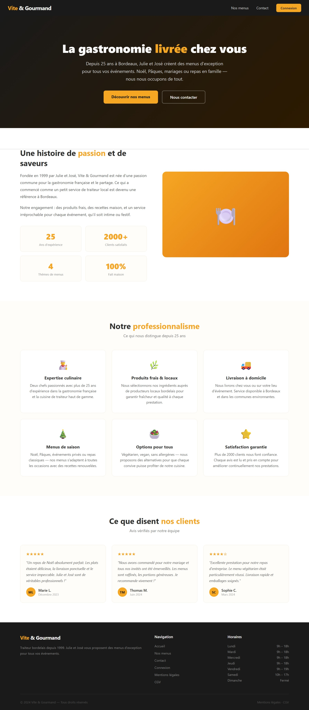
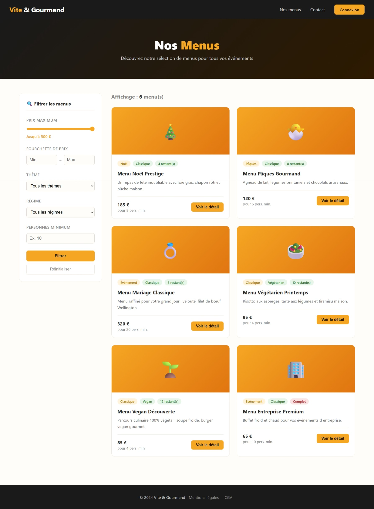
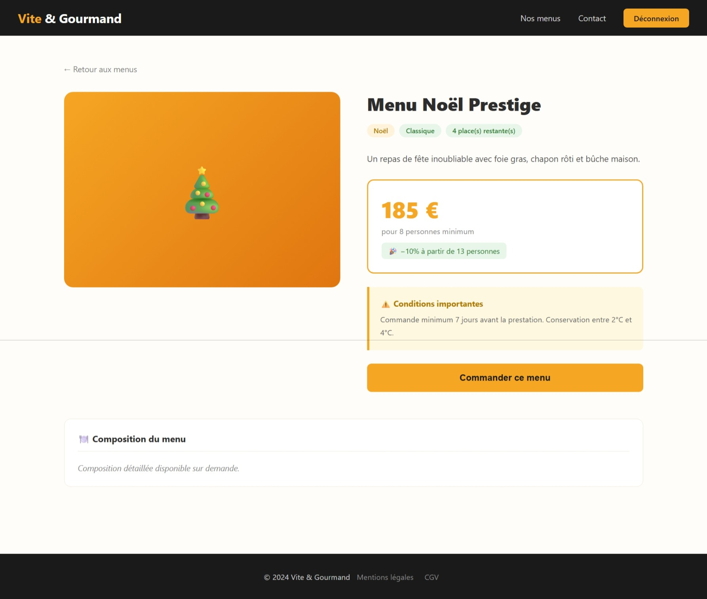
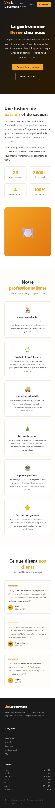
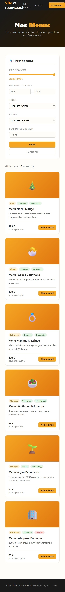
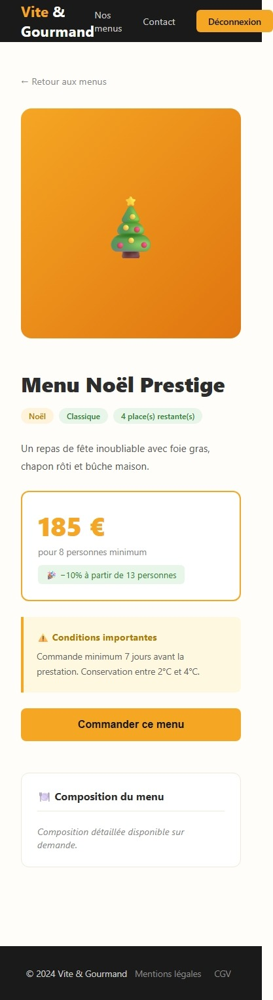

# Charte Graphique – Vite & Gourmand

## Palette de couleurs

| Nom | Code HEX | Utilisation |
|-----|----------|-------------|
| Orange principal | #F5A623 | Boutons, accents, logo |
| Orange foncé | #E09510 | Hover boutons |
| Noir profond | #1A1A1A | Navigation, footer, textes foncés |
| Brun foncé | #2D1A00 | Dégradé hero |
| Blanc cassé | #FFFDF9 | Fond principal |
| Gris clair | #F5F0E8 | Fonds secondaires |
| Bordure beige | #F0E8D8 | Bordures des cartes |
| Texte principal | #2D2D2D | Textes courants |
| Texte secondaire | #666666 | Descriptions, sous-titres |
| Vert succès | #2E7D32 | Messages succès, badges disponibles |
| Rouge erreur | #C62828 | Messages erreurs, badges complets |

## Typographie

| Usage | Police | Taille | Graisse |
|-------|--------|--------|---------|
| Corps de texte | Segoe UI | 16px | 400 |
| Titres H1 | Segoe UI | 2.5rem | 800 |
| Titres H2 | Segoe UI | 2rem | 700 |
| Navigation | Segoe UI | 0.9rem | 400 |
| Boutons | Segoe UI | 1rem | 700 |
| Badges | Segoe UI | 0.75rem | 600 |

## Composants

### Bouton principal
- Fond : #F5A623
- Texte : #1A1A1A
- Border-radius : 8px
- Padding : 14px 32px
- Hover : #E09510

### Carte menu
- Fond : #FFFFFF
- Bordure : 1px solid #F0E8D8
- Border-radius : 12px
- Shadow hover : 0 8px 30px rgba(245,166,35,.15)

### Navigation
- Fond : #1A1A1A
- Liens : #CCCCCC
- Hover liens : #F5A623
- Height : 64px
- Position : sticky top

## Maquettes desktop

### Page d'accueil
- Hero : dégradé #1A1A1A → #2D1A00 avec titre centré
- Section À propos : grille 2 colonnes (texte + visuel)
- Section valeurs : grille 3 colonnes
- Section avis : grille 3 colonnes

### Page menus
- Mise en page : sidebar filtres (280px) + grille menus
- Cartes menus : grille auto-fill minmax(280px, 1fr)
- Filtres : position sticky

### Page détail menu
- Grille 2 colonnes : image + informations
- Prix mis en évidence avec bordure orange
- Conditions en encadré jaune bien visible

## Maquettes mobile (responsive)

### Breakpoint principal : 768px
- Navigation : liens réduits
- Grilles : passage en 1 colonne
- Hero : titre réduit à 2rem
- Sidebar filtres : position static

### Page d'accueil mobile
- Hero pleine largeur, texte centré
- Sections en colonne unique
- Cartes empilées verticalement

### Page menus mobile
- Filtres en haut, pleine largeur
- Cartes en colonne unique

## Principes de design

- Design épuré et professionnel
- Couleur dominante orange pour rappeler la gastronomie et la chaleur
- Fond blanc cassé pour un rendu chaleureux et appétissant
- Cartes avec ombres légères au hover pour l'interactivité
- Conditions de commande toujours bien visibles en encadré coloré

## Maquettes desktop

### Accueil

### Page menus

### Détail menu

## Maquettes mobile

### Accueil mobile

### Page menus mobile

### Détail menu mobile
